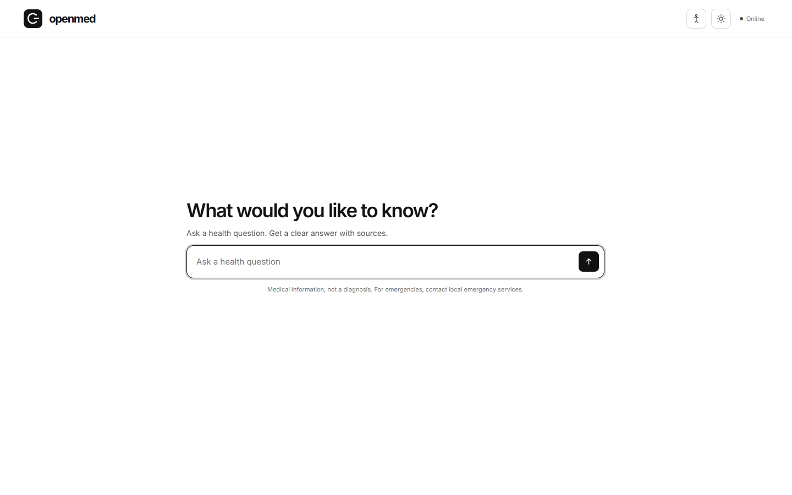

# OpenMed

Ask a health question and get an evidence-grounded answer with source articles. OpenMed combines a FastAPI agent, clinical calculators, and an interactive 3D anatomy viewer in a single web application.

**[Try the live app](https://medisearch-agent.vercel.app/)** · [How it works](docs/ARCHITECTURE.md) · [Contributing](CONTRIBUTING.md)

> OpenMed provides educational information, not a diagnosis or a substitute for a clinician. For emergencies, contact local emergency services.



[More screenshots and a short screen recording](docs/VISUALS.md)

## What you can do

- Ask a question in plain language and follow up in the same conversation.
- Read an answer linked to medical source articles. If retrieval fails, the agent does not invent supporting sources.
- Use deterministic clinical calculators when relevant to the question.
- Explore anatomy by layer, region, or named structure in the 3D body map.
- Switch between light and dark themes on desktop or mobile.

## Run locally

You need Python 3.12 or newer, [uv](https://docs.astral.sh/uv/getting-started/installation/), and API keys from [Cerebras Cloud](https://inference-docs.cerebras.ai/console/api-keys) and [MediSearch Developers](https://medisearch.io/developers/docs). The keys belong to those services; Vercel does not provide them.

```bash
git clone https://github.com/ompathak2004/Medical-Harness.git
cd Medical-Harness
uv sync --locked
```

Copy the example configuration and fill in the two required keys:

```bash
# macOS / Linux
cp .env.example .env

# Windows PowerShell
Copy-Item .env.example .env
```

Set `CEREBRAS_API_KEY` and `MEDISEARCH_API_KEY` in `.env`, then start the app:

```bash
uv run medisearch-agent
```

Open <http://localhost:8080>. Check <http://localhost:8080/api/health> if the page does not load. The interactive API reference is at <http://localhost:8080/docs>.

The `.env` file is ignored by Git. Do not commit keys or put them in screenshots, issues, or pull requests. Tests use fake keys and do not call the paid APIs.

### Docker

```bash
docker build -t openmed .
docker run --env-file .env -p 8080:8080 openmed
```

## Repository map

| Path | Purpose |
| --- | --- |
| `app/main.py` | FastAPI app, middleware, lifecycle, static frontend |
| `app/api/routes.py` | Chat, streaming chat, health, and metrics routes |
| `app/pipeline.py` | Triage, retrieval, calculators, generation, safety review |
| `app/prompts.py` | LLM instructions and output formats |
| `app/llm.py`, `app/evidence.py` | Cerebras and MediSearch clients |
| `app/tools/` | Clinical calculators and anatomy region detection |
| `static/` | Browser UI, styles, scripts, and licensed anatomy assets |
| `tests/` | Mocked API and deterministic pipeline tests |
| `docs/` | Architecture, API, deployment, and visual walkthrough |

Read [the architecture guide](docs/ARCHITECTURE.md) for the request flow and the [API guide](docs/API.md) for example requests and streaming events. [AGENTS.md](AGENTS.md) is the short working map for coding agents.

## Develop

```bash
uv sync --locked
uv run pytest -q
```

See [CONTRIBUTING.md](CONTRIBUTING.md) for change and pull request guidance. CI runs the test suite without production secrets. The optional HealthBench evaluation is documented in [docs/EVALUATION.md](docs/EVALUATION.md) and requires provider keys.

## Deploy

The app can run as one FastAPI Function on Vercel. Import this repository, keep the root directory at the repository root, and add `CEREBRAS_API_KEY` and `MEDISEARCH_API_KEY` in **Project Settings → Environment Variables** before deploying. The checked-in `vercel.json` sets a 180-second function limit. You can also deploy with `vercel deploy --prod` after linking a project.

Docker and DigitalOcean deployment notes are in [docs/DEPLOYMENT.md](docs/DEPLOYMENT.md). Environment variable details are in [docs/CONFIGURATION.md](docs/CONFIGURATION.md). The in-memory cache and rate limiter are local to each process or Vercel Function instance.

## License and attribution

The application code is [MIT licensed](LICENSE). The included BodyParts3D-derived anatomy data is licensed separately under [CC BY 4.0](https://creativecommons.org/licenses/by/4.0/); see [NOTICE.md](NOTICE.md) for attribution and asset details.
