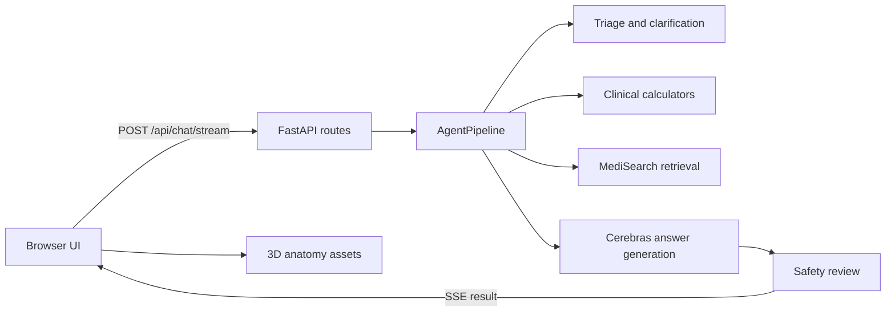

# Architecture

OpenMed serves one browser application and one FastAPI backend. The frontend is plain HTML, CSS, and JavaScript; the anatomy viewer loads three.js from a CDN. There is no Node build step or persistent database.

## One question, step by step

1. `static/js/app.js` sends the conversation to `POST /api/chat/stream`. The UI also manages the theme, messages, citation panels, and anatomy drawer.
2. `app/api/routes.py` validates the alternating conversation, sets a per-request cache scope, enforces concurrency and a timeout, and streams events. `app/main.py` sets up middleware, provider clients, and the pipeline during startup.
3. `AgentPipeline.run_streaming()` first asks Cerebras to classify the question as `emergency`, `ask`, or `answer`. An emergency result stops the normal pipeline. An `ask` result returns up to three clarification questions; only one clarification round is allowed.
4. For an answer, tool selection and MediSearch retrieval run concurrently. Selected calculators execute deterministic Python functions from `app/tools/clinical.py`; the model extracts input variables but does not calculate scores.
5. If no source articles arrive, the pipeline returns an evidence-unavailable answer. Otherwise it generates an answer, runs a separate safety review, and only then emits the reviewed answer and final result. The current implementation does **not** send unreviewed tokens to the browser.
6. The browser renders articles, calculator results, follow-up suggestions, and anatomy context. `static/js/anatomy-viewer.js` loads the layered GLB assets on demand.

## Main modules

| Module | Responsibility |
| --- | --- |
| `app/config.py` | Validated environment settings with `.env` support |
| `app/main.py` | App factory, lifecycle, middleware, HTML and static routes |
| `app/api/routes.py` | Buffered and SSE chat, health, protected metrics |
| `app/pipeline.py` | Agent control flow, step and evidence caching |
| `app/prompts.py` | Triage, tool, answer, and review instructions |
| `app/llm.py` | Async Cerebras calls and usage accounting |
| `app/evidence.py` | Async MediSearch SSE retrieval and retry |
| `app/cache.py` | In-memory TTL/LRU cache keyed by conversation hash and session scope |
| `app/rate_limit.py` | In-memory per-client request limiter |
| `app/tools/clinical.py` | Calculator registry and pure Python math |
| `app/tools/anatomy.py` | Question-to-anatomy region mapping |

## Safety and failure behavior

Triage precedes normal answering. Evidence is required for a sourced answer; retrieval failure produces an explicit limitation. The answer review can accept or revise an answer, and a failed review stops the answer path. The UI and API show emergency guidance separately from normal answers. These are application safeguards, not proof of clinical validity.

The caches and rate limiter live in each process. On Vercel, different Function instances do not share them. OpenMed has no user accounts, database, or durable conversation history. The browser holds the conversation during the page session and sends it with each request.

## Where to make a change

- New API field: `app/schemas.py` → `app/api/routes.py` → `static/js/app.js` → [API documentation](API.md).
- New calculator: register a pure function in `app/tools/clinical.py`, test it, then update prompt/tool descriptions and this guide.
- New provider behavior: edit `app/llm.py` or `app/evidence.py`, preserve safe failure paths, and add mocked tests.
- UI or theme: edit `static/index.html`, `static/js/`, and `static/css/`; check mobile and both themes.
- Anatomy assets: use `scripts/build_anatomy_assets.py` and preserve [attribution](../NOTICE.md).

The older `BLUEPRINT.md` has been retired because it described behavior that diverged from the running code. This guide and the source are the current references.
