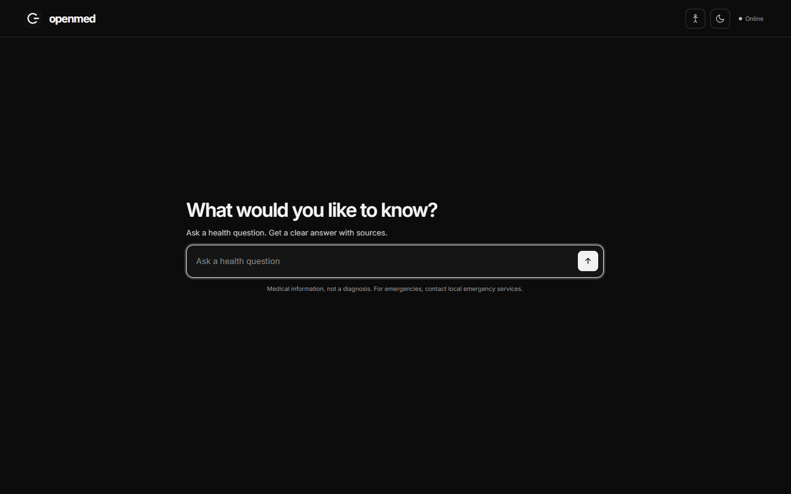
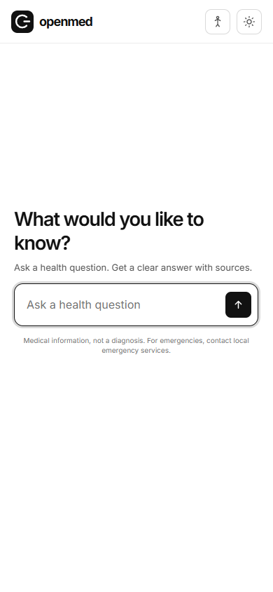
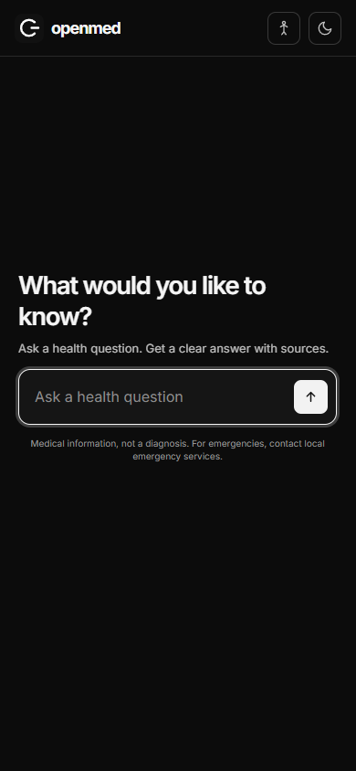

# Screenshots and recording

These captures show the public OpenMed interface with no private health data or API keys. The recording demonstrates theme switching and question entry; it does not show an answer.

## Desktop

| Light | Dark |
| --- | --- |
|  |  |

## Mobile

| Light | Dark |
| --- | --- |
|  |  |

## Screen recording

[Watch or download the short walkthrough](media/walkthrough.webm) (`.webm`, approximately 250 KB). It shows the actual browser UI at desktop width. For the interactive product, open the [live app](https://medisearch-agent.vercel.app/).
